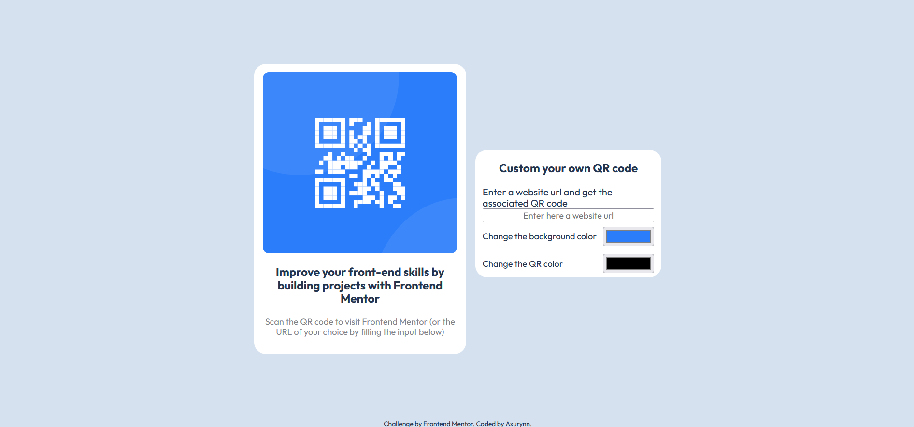
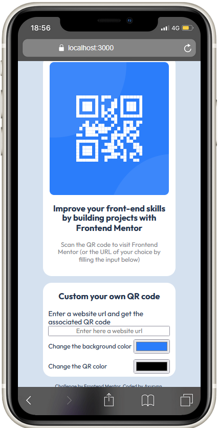

# Frontend Mentor - QR Code Component solution

This is a solution to the [QR Code Component challenge on Frontend Mentor](https://www.frontendmentor.io/challenges/qr-code-component-iux_sIO_H). Frontend Mentor challenges help you improve your coding skills by building realistic projects.

## Table of contents

- [Frontend Mentor - QR Code Component solution](#frontend-mentor---qr-code-component-solution)
  - [Table of contents](#table-of-contents)
  - [Overview](#overview)
    - [The challenge](#the-challenge)
    - [Screenshots](#screenshots)
    - [Links](#links)
  - [My process](#my-process)
    - [Built with](#built-with)
    - [Useful resources](#useful-resources)
  - [Author](#author)
  - [Acknowledgments](#acknowledgments)

## Overview

### The challenge

Users should be able to:

- See a first QR code leading directly to the frontend mentor site
- Custom their own QR code leading to the site of their choice
- Custom the obtained QR code by changing the background color and the QR code color

### Screenshots

Desktop screenshot

Mobile screenshot

### Links

- Solution URL: [qr-code-component](https://github.com/Axurynn/qr-code-component)
- Live solution: [qr-code-component_live](https://axurynn.github.io/qr-code-component/)

## My process

### Built with

- Semantic HTML5 markup
- SCSS custom properties
- Flexbox
- Mobile-first workflow
- [ReactJS](https://reactjs.org/) library

### Useful resources

- [react-qr-code](https://www.npmjs.com/package/react-qr-code) - This helped me to add custom QR code.
- [react-qr-code repository](https://github.com/rosskhanas/react-qr-code#readme)

## Author

- Website - [Axurynn](https://axurynn.fr)
- Frontend Mentor - [@axurynn](https://www.frontendmentor.io/profile/axurynn)
- Twitter - [@Drc_Axu](https://www.twitter.com/Drc_Axu)

## Acknowledgments

Special thanks to [Baptjack](https://baptjack.fr) who help me completed this challenge.
